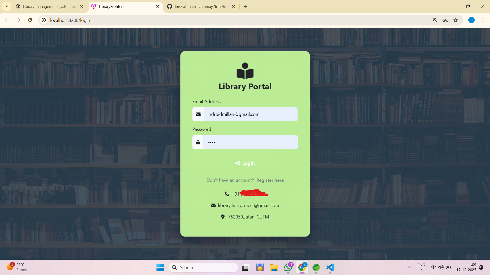

# 📚 Library Management System (LMS)

A full-stack **Library Management System** built using **Angular (standalone)** and **Spring Boot** to manage book borrowing, returns, approvals, and email notifications.

---

## 🚀 Tech Stack

### Frontend
- Angular (Standalone setup)
- HTML, CSS, TypeScript
- SessionStorage for session handling
- Route Guards

### Backend
- Spring Boot
- REST APIs
- Hibernate / JPA
- MySQL Database
- JavaMail (SMTP) for Email Notifications

---

## ✨ Features

### 👤 Student
- Register & Login
- View available books
- Send borrow requests
- View borrowed books
- Receive email notifications

### 🧑‍💼 Librarian
- Approve / Reject borrow requests
- View borrowed books
- Send due-date & overdue reminders

---

## 📸 Application Screenshots

### 🔐 Login Page


### 📝 Register Page


### 🏠 Student Dashboard


### 📚 Borrow Books


### 📖 My Borrowed Books


### 🧑‍💼 Librarian Dashboard


---

## ⚙️ Email Configuration

Email notifications are currently implemented using **JavaMail (SMTP)**.

```properties
spring.mail.host=smtp.gmail.com
spring.mail.port=587
spring.mail.username=library.lms.project@gmail.com
spring.mail.password=****************
spring.mail.properties.mail.smtp.auth=true
spring.mail.properties.mail.smtp.starttls.enable=true
